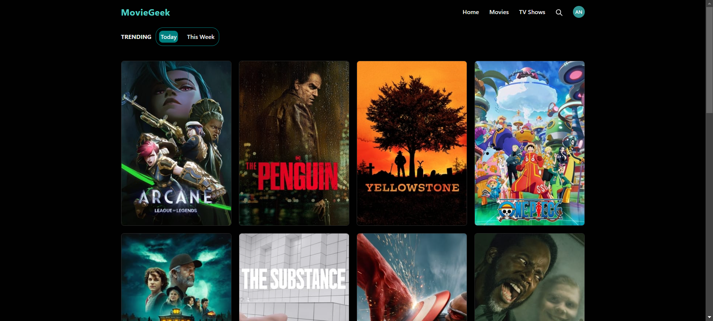
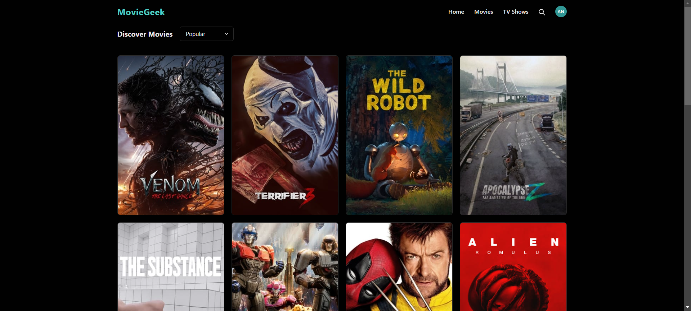
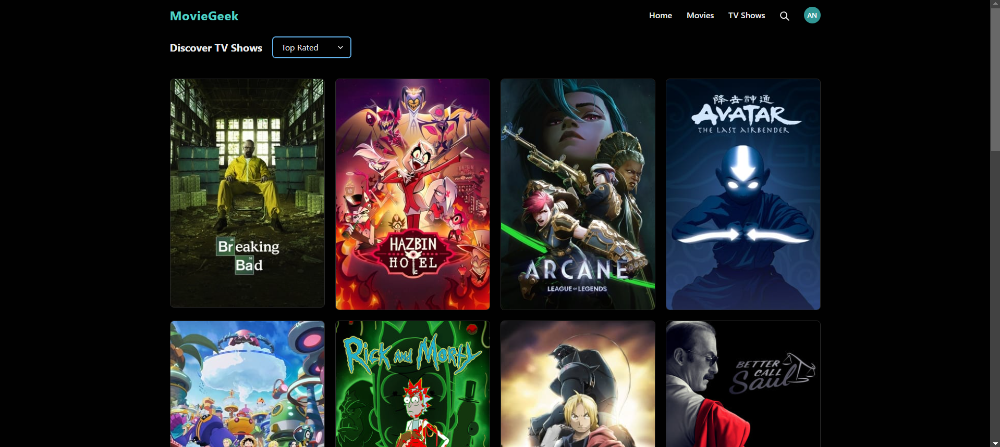
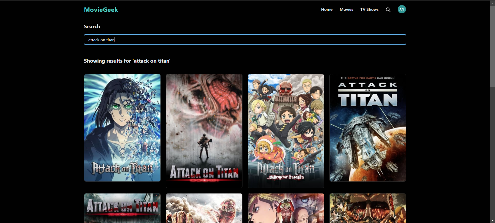
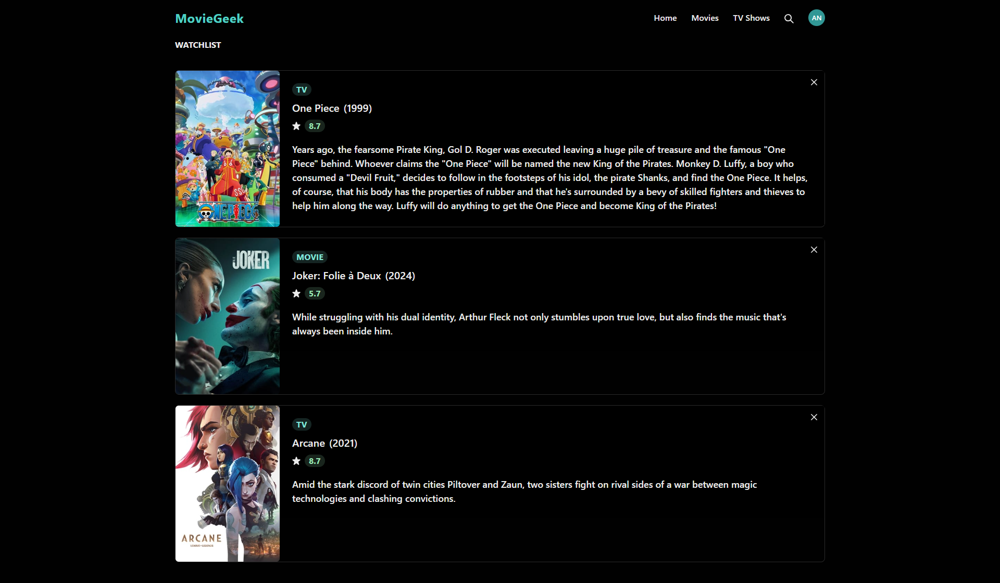
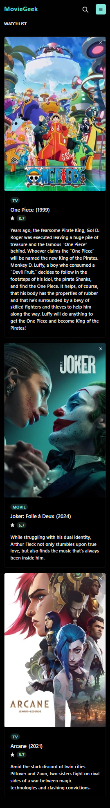
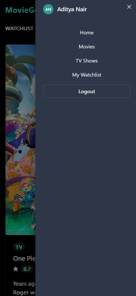

# MovieGeek 🎬

MovieGeek is a dynamic movie and TV show application that lets users discover trending content, view detailed information, and manage their own watchlist. Built with Chakra UI for a responsive and modern interface, MovieGeek uses the TMDB API to fetch up-to-date data on the latest movies and shows.

---

## Table of Contents

- [Features](#features)
- [Demo](#demo)
- [Installation](#installation)
- [Usage](#usage)
- [Screenshots](#screenshots)
- [Technologies](#technologies)
- [API Reference](#api-reference)
- [Contributing](#contributing)

---

## Features

- **Trending Content**: Default display of trending movies or shows for today, with an option to view weekly trends.
- **Intuitive UI**: Built with Chakra UI for easy navigation and a fully responsive experience.
- **Movie & Show Pages**: Browse movies and shows separately, with pagination for smooth exploration.
- **Filter Options**: Filter content based on average rating and popularity.
- **Search Functionality**: Search movies or shows by title.
- **Detailed Info Pages**: View content details, including an overview, release date, cast, and trailers.
- **Watchlist Management**: Add and remove items to/from a watchlist. View all items in the watchlist, with options to remove them.

---

## Demo

Check out a live demo of [MovieGeek](https://movie-flex-07.vercel.app/).

---

## Installation

To set up MovieGeek locally, follow these steps:

1. **Clone the repository**:

   ```bash
   git clone https://github.com/AdityaNair07/movie-app.git
   cd movie-app

2. **Install dependencies**:

   ```bash
   npm install

3. **Set up environment variables**:

   - Create a .env file in root directory
   - Add your TMDB API key and firebase configurations:

   ```bash
    VITE_API_KEY = TMDB_API_KEY

    VITE_FIREBASE_API_KEY = FIREBASE_API_KEY

    VITE_AUTH_DOMAIN = AUTH_DOMAIN

    VITE_PROJECT_ID = PROJECT_ID

    VITE_STORAGE_BUCKET = STORAGE_BUCKET

    VITE_MSG_SENDER_ID = MSG_SENDER_ID

    VITE_APP_ID = APP_ID

4. **Run the application**:

    ```bash
    npm run dev

## Usage

- **Home Page**: Displays trending movies or shows for today by default, with an option to view weekly trends.
- **Filter and Search**: Use filters based on rating and popularity, or search for specific movies or shows.
- **Detailed Information**: Access detailed information including cast, overview, and trailers by clicking on any movie or show.
- **Watchlist Management**: Easily add content to your watchlist from detail pages and manage it on the Watchlist page.

---

## Screenshots

*Home page showing trending movies*


*Details page with cast and trailer*


*Movies page showcasing movies*


*Shows page showcasing shows*


*Search page showcasing searched items*


*Watchlist page showcasing saved items*


*Responsive view of the application*
 

---

## Technologies

- **React**: For building the frontend.
- **Chakra UI**: For responsive UI components.
- **TMDB API**: For fetching movie and show data.
- **Axios**: For handling API requests.
- **React Router**: For managing navigation.

---

## API Reference

MovieGeek uses the [TMDB API](https://www.themoviedb.org/documentation/api) to fetch movie and show data. Refer to TMDB's API documentation for more details on the endpoints and parameters.

---

## Contributing

Contributions are welcomed! If you'd like to improve MovieGeek, please follow these steps:

1. Fork the repository.
2. Create a feature branch: `git checkout -b feature/YourFeature`.
3. Commit your changes: `git commit -m 'Add YourFeature'`.
4. Push to the branch: `git push origin feature/YourFeature`.
5. Open a pull request.

---

## Happy Coding 😁
